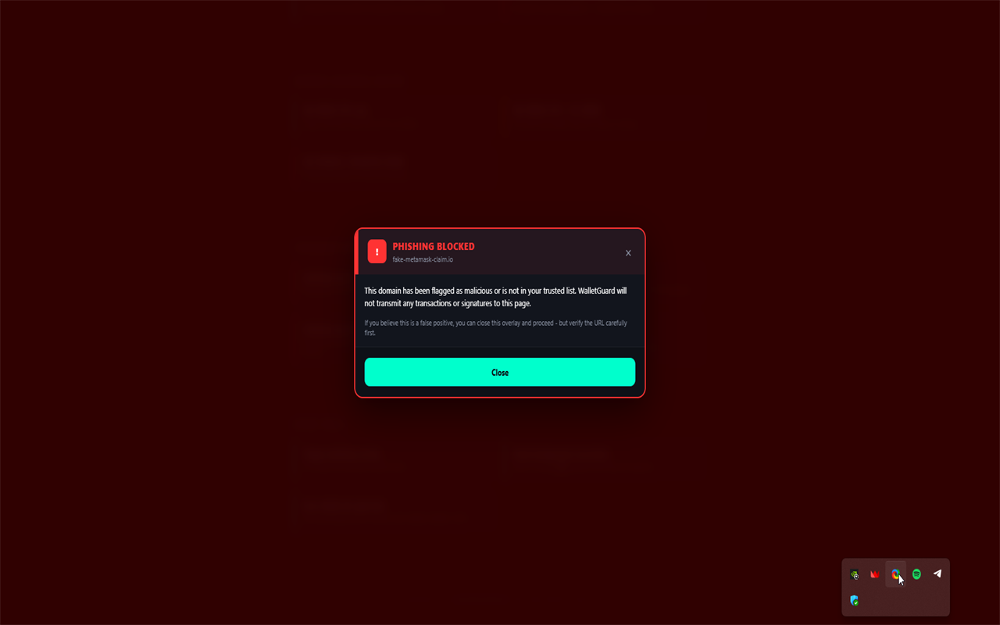
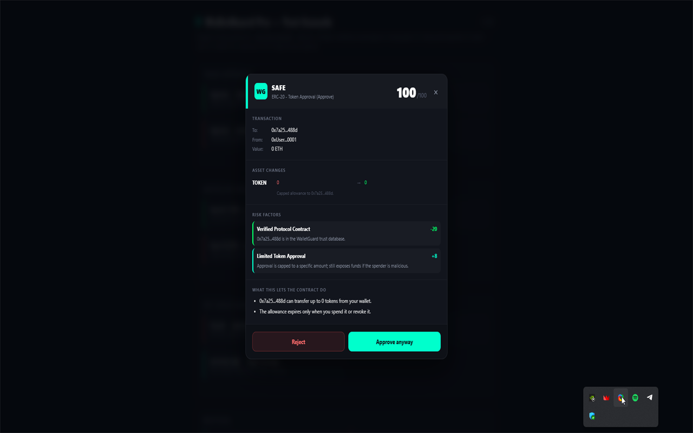
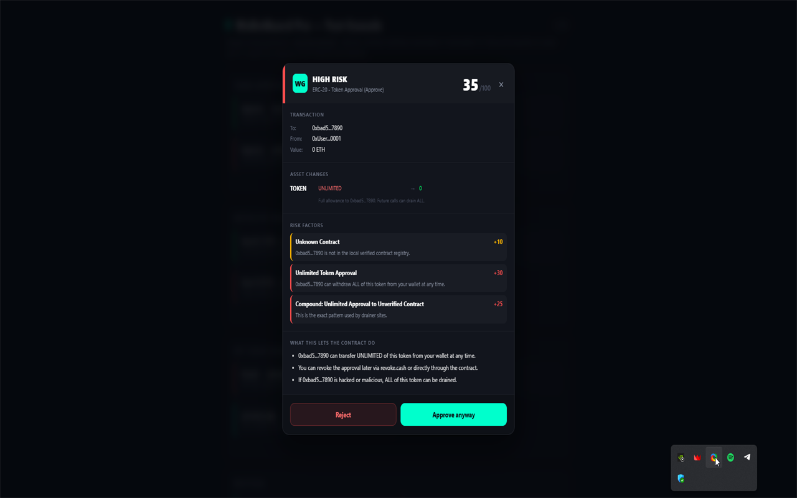
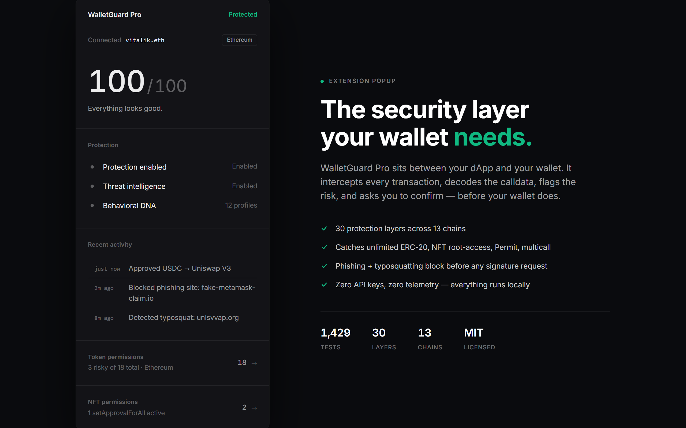

# WalletGuard Pro

> A browser extension that intercepts Web3 transactions before signing and explains what they actually do.

## Problem

Web3 wallets ask users to approve raw calldata they cannot read. Most drainers, phishing sites, and unlimited token approvals rely on that gap. One wrong signature can empty a wallet.

## Why I Built It

I wanted a security layer for my own wallet that would decode transactions in plain language, flag risky behavior, and work without sending my data anywhere. Existing tools often require accounts, API keys, or backends. WalletGuard Pro was built to stay local, open-source, and privacy-first.

## Solution

WalletGuard Pro is a browser extension that sits between the user and the wallet. It intercepts transactions before they reach MetaMask or any supported wallet, decodes the calldata locally, and explains the risk. The core protection runs in the browser with zero backend dependencies.

## Features

- Decodes ERC-20, ERC-721, and ERC-1155 transfers and approvals.
- Detects phishing and typosquatting sites before a transaction is created.
- Scans ERC-20 and NFT approvals across multiple chains.
- Scores transaction risk with explicit factor breakdown.
- Simulates transactions locally to catch reverts before signing.
- Identifies EIP-7702 delegation, session keys, MEV exposure, and drainer patterns.
- Supports multiple languages through an embedded i18n system.
- Stores no user data on a server.

## Screenshots

| | |
|---|---|
|  |  |
| Phishing site blocked at request time | Calldata decoded — every transaction shows what it actually does |
|  |  |
| Risk score with explicit factor breakdown | Approval scanner dashboard |

## Architecture

The extension is built as a Manifest V3 browser extension with no runtime dependencies:

- `background.js` — service worker for state, orchestration, and message routing.
- `injector.js` — intercepts `window.ethereum.request` in the page context.
- `content.js` — bundled orchestrator with UI overlays and RPC bridge.
- `approval-scanner.js` — scans approvals across chains via the wallet RPC or public endpoints.
- `popup/` — dashboard and approval scanner UI.
- `settings/` — configuration, whitelist, blacklist, and language selection.
- `lib/` — source modules bundled into content scripts.
- `test-*.js` — 1,429 automated tests covering every module.

See `docs/` and `THREAT_MODEL.md` for deeper technical documentation.

## Installation

### From source

```bash
git clone https://github.com/eupho808/walletguard-pro
cd walletguard-pro
node build.js
```

Then open `chrome://extensions/`, enable Developer mode, click Load unpacked, and select the project folder.

### Chrome Web Store

Submission is in progress. The listing link will be added once approved.

## Usage

After installing the extension, connect your wallet as usual. WalletGuard Pro will show a risk summary before each transaction and block known phishing sites. Open the extension popup to review existing approvals and revoke stale ones.

## Testing

All tests run in plain Node without a browser:

```bash
node test-typosquat.js
node test-integration.js
node test-multichain.js
node test-nft.js
node test-revoke.js
node test-build.js
node test-i18n.js
node test-onboarding.js
```

Run the full suite via CI in `.github/workflows/test.yml`.

## Roadmap

- [x] Core transaction interception and decoding
- [x] Risk engine with explicit factor breakdown
- [x] Approval scanner and bulk revoke
- [x] Phishing and typosquatting defense
- [x] EIP-7702 and session-key detection
- [x] Multi-language support
- [ ] Chrome Web Store approval
- [ ] Firefox AMO submission
- [ ] On-device learning for wallet behavior

## FAQ

**Q: Does WalletGuard Pro send my transaction data to a server?**

No. The extension runs locally. The only optional external call is to OpenRouter for AI-assisted explanations, which sends only the contract address, never your wallet or transaction data.

**Q: Can it stop every possible attack?**

No. It covers the most common drain patterns and risky approvals, but no tool can guarantee complete security. Read `THREAT_MODEL.md` for what is and is not in scope.

**Q: Is it audited by a third party?**

Not yet. We publish `SELF_AUDIT.md` and `AUDIT_PACKAGE.md` to make external review easier.

## Contributing

PRs are welcome. Please open an issue first for non-trivial changes. The test suite is the source of truth — if you change behavior in `lib/`, add or update a matching `test-*.js`.

## Documentation

- [`THREAT_MODEL.md`](./THREAT_MODEL.md) — what we protect against and what we do not.
- [`SELF_AUDIT.md`](./SELF_AUDIT.md) — internal security review and findings.
- [`SECURITY.md`](./SECURITY.md) — responsible disclosure.
- [`PRIVACY.md`](./PRIVACY.md) — privacy policy.
- [`CONTRIBUTING.md`](./CONTRIBUTING.md) — development guidelines.
- [`CHANGELOG.md`](./CHANGELOG.md) — version history.

## License

[MIT](./LICENSE)

---

*Read the project story in [PROJECT_STORY.md](./PROJECT_STORY.md).*
